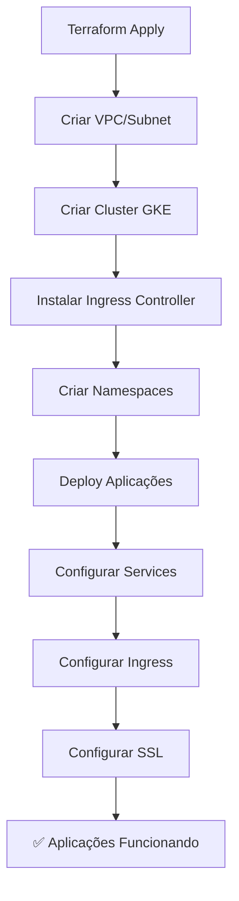

# 🚀 Automação Completa com Terraform

## **📋 Visão Geral**

Este projeto demonstra como automatizar **TUDO** usando apenas Terraform, incluindo:
- ✅ Infraestrutura GCP (VPC, Subnets, Cluster GKE)
- ✅ Monitoramento (Prometheus + Grafana)
- ✅ Aplicações (DevOps + SRE)
- ✅ Ingress e SSL automático

## **🤔 Por que APENAS Terraform?**

### **✅ VANTAGENS:**
1. **Um único tool** para toda a infraestrutura
2. **Estado centralizado** e gerenciado
3. **Dependências automáticas** entre recursos
4. **Rollback fácil** com `terraform destroy` ou versões anteriores
5. **Idempotência** - sempre aplica a configuração desejada
6. **Manutenção simples** - menos arquivos para gerenciar

### **❌ QUANDO USAR ANSIBLE:**
- Aplicações com configurações **muito complexas**
- **Orquestração** de múltiplos ambientes
- **Configurações dinâmicas** que mudam frequentemente
- **Scripts customizados** complexos

## **🏗️ Estrutura dos Arquivos**

```
Terraform/
├── main.tf                    # Infraestrutura GCP
├── prometheus-grafana.tf      # Monitoramento
├── applications.tf            # Aplicações DevOps + SRE
├── variables.tf               # Variáveis configuráveis
├── terraform.tfvars.example   # Exemplo de configuração
└── README-AUTOMACAO.md        # Este arquivo
```

## **🚀 Como Usar**

### **1. Configurar Variáveis:**
```bash
# Copiar o arquivo de exemplo
cp terraform.tfvars.example terraform.tfvars

# Editar as variáveis conforme necessário
nano terraform.tfvars
```

### **2. Aplicar Tudo:**
```bash
# Verificar o plano
terraform plan

# Aplicar todas as configurações
terraform apply -auto-approve
```

### **3. Resultado:**
- ✅ Cluster GKE criado
- ✅ Monitoramento configurado
- ✅ Aplicações DevOps e SRE rodando
- ✅ Ingress configurado com SSL
- ✅ Domínios funcionando

## **🔄 Workflow de Deploy**



## **📊 Comparação: Terraform vs Terraform + Ansible**

| Aspecto | Apenas Terraform | Terraform + Ansible |
|---------|------------------|---------------------|
| **Simplicidade** | ✅ Simples | ❌ Complexo |
| **Manutenção** | ✅ Fácil | ❌ Difícil |
| **Estado** | ✅ Centralizado | ❌ Distribuído |
| **Rollback** | ✅ Fácil | ❌ Complexo |
| **Flexibilidade** | ⚠️ Limitada | ✅ Alta |
| **Curva de Aprendizado** | ✅ Baixa | ❌ Alta |

## **🎯 Recomendação para Seu Projeto**

### **USE APENAS TERRAFORM** porque:

1. **Suas aplicações são simples** (WhoAmI com configurações básicas)
2. **Você já tem experiência** com Terraform
3. **Manutenção mais simples** com um único tool
4. **Estado centralizado** e fácil de gerenciar
5. **Rollback automático** se algo der errado

## **🔧 Melhorias Implementadas**

### **Antes (Manual):**
```bash
# Criar namespace
kubectl create namespace devops

# Aplicar deployment
kubectl apply -f devops/

# Verificar status
kubectl get pods -n devops
```

### **Depois (Terraform):**
```bash
# Aplicar tudo automaticamente
terraform apply -auto-approve

# Resultado: tudo funcionando!
```

## **📈 Benefícios da Automação**

1. **Reprodutibilidade**: Sempre o mesmo resultado
2. **Versionamento**: Controle de versão da infraestrutura
3. **Colaboração**: Equipe pode trabalhar na mesma infraestrutura
4. **Auditoria**: Histórico completo de mudanças
5. **Segurança**: Menos erros humanos
6. **Escalabilidade**: Fácil replicar para outros ambientes

## **🚨 Considerações Importantes**

### **Quando Migrar para Ansible:**
- Aplicações com **configurações muito complexas**
- **Orquestração** de múltiplos ambientes
- **Scripts customizados** complexos
- **Configurações dinâmicas** frequentes

### **Manter com Terraform:**
- **Infraestrutura estável**
- **Aplicações simples**
- **Equipe pequena**
- **Foco em infraestrutura**

## **🎉 Conclusão**

Para seu projeto atual, **Terraform sozinho é a melhor escolha**. Ele oferece:
- ✅ Simplicidade
- ✅ Confiabilidade
- ✅ Manutenibilidade
- ✅ Escalabilidade

**Mantenha a simplicidade e use apenas Terraform! 🚀**
